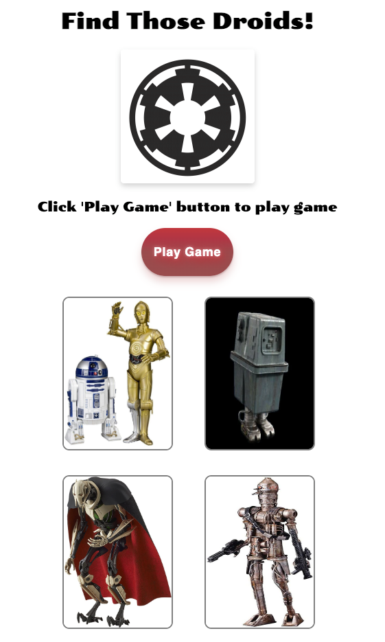

# freeCodeCamp - Card Game Project ("Find the Droid")

This is a Star Wars themed version of the [JavaScript Tutorial - Create a Card Game 🃏](https://www.youtube.com/watch?v=Bj6lC93JMi0).

## Table of contents

- [Overview](#overview)
  - [Screenshot](#screenshot)
  - [Links](#links)
- [My process](#my-process)
  - [Built with](#built-with)
  - [What I learned](#what-i-learned)
  - [Continued development](#continued-development)
  - [Useful resources](#useful-resources)
- [Author](#author)
- [Acknowledgments](#acknowledgments)

## Overview

This tutorial not only covers creating a basic card game using JavaScript
but also:

- how to create dynamic user interactive code using vanilla JavaScript
- Creating some animation effects
- Responsive layout design using CSS grid, CSS FlexBox and media queries
- How to dynamically change the positions of grid cells, so as to randomize the positions of the cards contained in a css grid using JavaScript,
- localStorage functionality
- And much More…

### Screenshot



### Links

- GitHub Repo: [](https://your-solution-url.com)
- Live Site URL: [](https://your-live-site-url.com)

## My process

-Followed

### Built with

- Semantic HTML5 markup
- CSS custom properties
- Flexbox
- CSS Grid
- CSS Animation
- Responsive mobile design
- Vanilla Javascript
- [Get CSS Scan](https://getcssscan.com/css-buttons-examples) - For button
- [CSSmatic](https://www.cssmatic.com/box-shadow) - For box shadows

### What I learned

- Creating helper functions to simplify code (DRY)
- How to dynamicaly add elements, including images using JS
- Started woring more with CSS Grid and dynamically updating grid-template-areas
- Using more custom CSS variables (DRY)
- Using developer tools to test and debug issues, mainly with console.log
- Using the setInterval and clearInterval functions
- The switch statement uses strict equality
- Dynamically updating CSS classes (add, remove, toggle)
- More game theory
- Working with updating and retriving data from localStorage
- Worked with CSS Animation to create flip and fly-in effects
- Using 3rd party web tools to generate CSS button and box-shadow stylings
- What is JSON?

Code snipperts:

```html

```

```css

```

```js
function randomizeCardPositions() {
  const random1 = Math.floor(Math.random() * numCards) + 1;
  const random2 = Math.floor(Math.random() * numCards) + 1;
  const temp = cardPositions[random1 - 1];

  cardPositions[random1 - 1] = cardPositions[random2 - 1];
  cardPositions[random2 - 1] = temp;
}

//Creating a grid areas template based on array indices
function returnGridAreasMappedToCardPos() {
  let firstPart = '';
  let secondPart = '';
  let areas = '';

  cards.forEach((card, index) => {
    if (cardPositions[index] == 1) {
      areas = areas + 'a ';
    } else if (cardPositions[index] == 2) {
      areas = areas + 'b ';
    } else if (cardPositions[index] == 3) {
      areas = areas + 'c ';
    } else if (cardPositions[index] == 4) {
      areas = areas + 'd ';
    }
    if (index == 1) {
      firstPart = areas.substring(0, areas.length - 1);
      areas = '';
    } else if (index == 3) {
      secondPart = areas.substring(0, areas.length - 1);
    }
  });
  return `"${firstPart}" "${secondPart}"`;
}
```

### Continued development

- Add background audio and alert sounds
- Add two player functionality
- Add fade-in animation to status text

### Useful resources

## Author

- GitHub - [Devin McDaniel](https://www.github.com/dmcdaniel90)

## Acknowledgments

Thanks to freeCodeCamp for providing free courses and tutorials for all!
